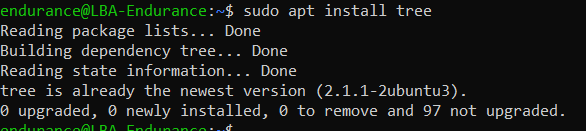
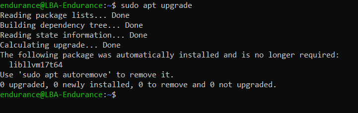
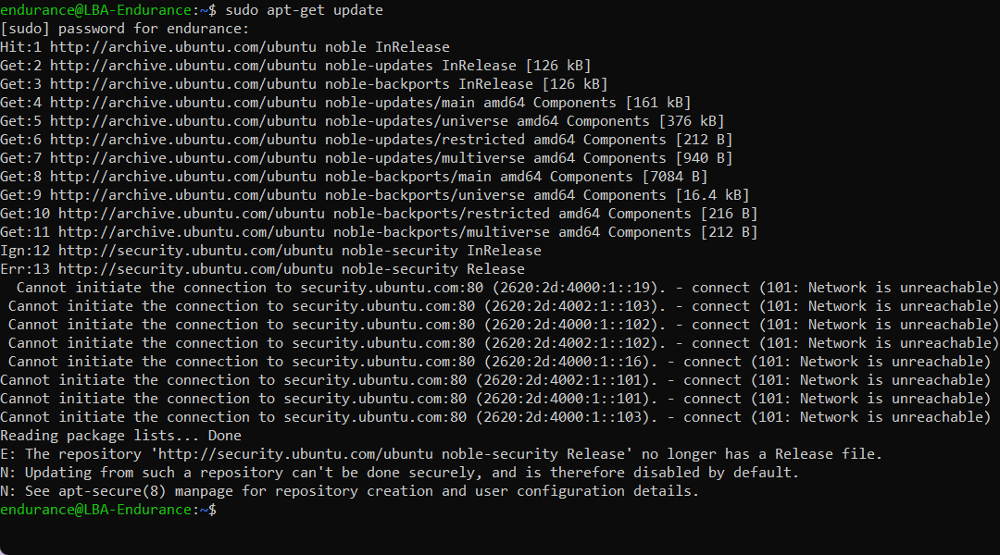

# INTRODUCTION-TO-LINUX
## Creating AWS Account, Setting Up Ubuntu, and Using Markdown for Links &amp; Screenshots

### Step 1: Create an AWS Account
# Go to the AWS website:

   - Open your browser and visit https://aws.amazon.com/

      - Click on “Create an AWS Account”:

         - You’ll find this button on the top right corner.

           - Fill in the registration form:

            - Enter your email, password, and AWS account name.

              - Click Continue.

## Provide contact information:

 - Choose personal or professional account.

    - Enter your details (name, phone, address).

       - Add payment information:

        - Enter valid credit card info (AWS requires it even for the free tier).

         -  Verify your phone number:

            - You’ll get a verification code via SMS or call.

                 - Choose a support plan:

                    - Select the Basic (free) plan.

                        - Finish signup and login:

#### After confirmation, log in to your AWS Management Console.

# Step 2: Setting Up Ubuntu
### Launch an Ubuntu instance on AWS (EC2):

  - From AWS Console, go to Services > EC2.

    - Click Launch Instance.

      - Select the latest Ubuntu Server AMI (Amazon Machine Image).

          - Choose instance type (e.g., t2.micro for free tier).

             - Configure instance details and storage as needed.

               - Add tags (optional).

                   - Configure security group: allow SSH (port 22).

                       - Review and launch.

                           - Create or select an existing key pair for SSH.

                              - Connect to your Ubuntu instance:

                                  - Open terminal on your local machine.
## Change permissions for your key file:

### bash

- chmod 400 your-key-file.pem
- Connect using SSH:

### bash
- ssh -i your-key-file.pem ubuntu@your-ec2-public-dns
- Update Ubuntu packages:

### bash: 
- sudo apt update 
  

- sudo apt upgrade -y
  

  ## Installation of Software like tree
### Use the Command
- sudo apt-get install tree
  

  ### sudo apt-get remove
   
  
  